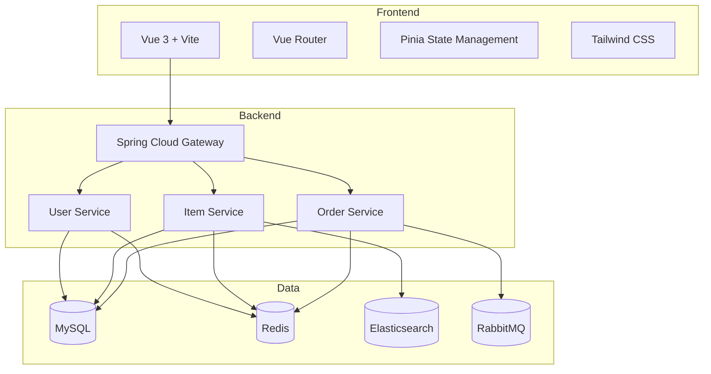
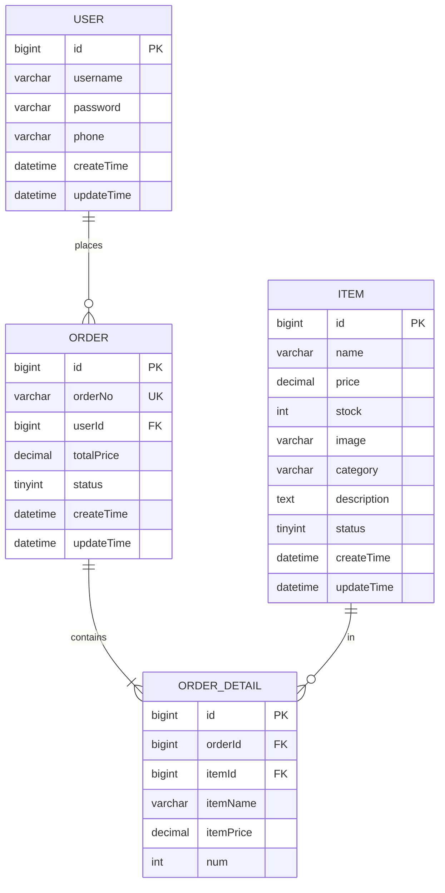

# TZ-Mall 电商平台 - 技术架构文档

## 1. Architecture Design


## 2. Technology Description
- **Frontend**: Vue@3 + TypeScript + Vite + Tailwind CSS + Vue Router + Pinia
- **Initialization Tool**: vite-init
- **Backend Integration**: Spring Cloud Gateway API 调用
- **HTTP Client**: Axios
- **UI Components**: 自定义轻奢风格组件

## 3. Route Definitions
| Route | Purpose |
|-------|---------|
| / | 用户端首页 |
| /products | 商品列表页 |
| /products/:id | 商品详情页 |
| /cart | 购物车页 |
| /orders | 订单列表页 |
| /orders/create | 创建订单页 |
| /login | 登录页 |
| /register | 注册页 |
| /admin | 管理后台首页 |
| /admin/products | 商品管理页 |
| /admin/orders | 订单管理页 |
| /admin/users | 用户管理页 |

## 4. API Definitions

### 4.1 Type Definitions
```typescript
// 用户相关
interface User {
  id: number;
  username: string;
  phone?: string;
  createTime: string;
}

interface LoginRequest {
  username: string;
  password: string;
}

interface LoginResponse {
  token: string;
  user: User;
}

// 商品相关
interface Item {
  id: number;
  name: string;
  price: number;
  stock: number;
  image?: string;
  category?: string;
  description?: string;
  status: number;
  createTime: string;
}

interface ItemQuery {
  keyword?: string;
  category?: string;
  minPrice?: number;
  maxPrice?: number;
  page?: number;
  size?: number;
}

// 购物车相关
interface CartItem {
  itemId: number;
  itemName: string;
  itemPrice: number;
  itemImage?: string;
  num: number;
}

// 订单相关
interface Order {
  id: number;
  orderNo: string;
  userId: number;
  totalPrice: number;
  status: number;
  createTime: string;
  details: OrderDetail[];
}

interface OrderDetail {
  id: number;
  orderId: number;
  itemId: number;
  itemName: string;
  itemPrice: number;
  num: number;
}

interface CreateOrderRequest {
  items: { itemId: number; num: number }[];
}
```

### 4.2 API Endpoints
- `POST /api/user/login` - 用户登录
- `POST /api/user/register` - 用户注册
- `GET /api/user/info` - 获取用户信息
- `GET /api/item/list` - 获取商品列表
- `GET /api/item/search` - 搜索商品
- `GET /api/item/:id` - 获取商品详情
- `POST /api/item` - 创建商品 (管理员)
- `PUT /api/item/:id` - 更新商品 (管理员)
- `DELETE /api/item/:id` - 删除商品 (管理员)
- `POST /api/order/create` - 创建订单
- `GET /api/order/list` - 获取订单列表
- `GET /api/order/:id` - 获取订单详情
- `PUT /api/order/:id/status` - 更新订单状态 (管理员)

## 5. Server Architecture Diagram (Backend
TZ-Mall 后端采用微服务架构，包括：
- Gateway 服务：路由转发、统一鉴权
- User Service：用户管理、JWT 认证
- Item Service：商品管理、ES 搜索
- Order Service：订单管理、分布式事务

## 6. Data Model

### 6.1 Data Model Definition


### 6.2 Data Definition Language
后端已包含数据库初始化脚本，无需在前端创建表结构。

