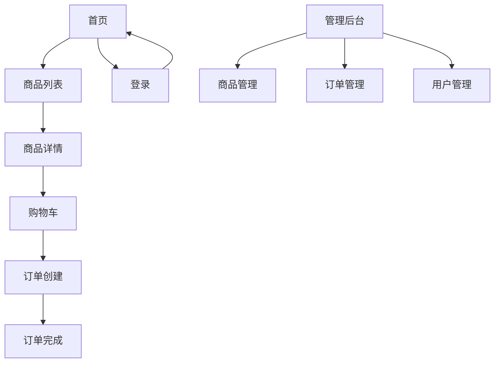

# TZ-Mall 电商平台 - 产品需求文档 (PRD)

## 1. Product Overview
TZ-Mall 是一个基于 Spring Cloud Alibaba 微服务架构的电商平台，包含用户端和管理员端。本前端项目为 TZ-Mall 提供美观、现代的用户界面，与后端微服务完美集成。

- 主要功能：商品浏览、购物车、订单管理、商品管理、订单管理等。
- 目标：打造一个轻奢风格的电商平台，展示前后端全栈技术能力。

## 2. Core Features

### 2.1 User Roles
| Role | Registration Method | Core Permissions |
|------|---------------------|------------------|
| Normal User | 用户名/密码注册 | 浏览商品、加入购物车、下单、查看订单 |
| Admin | 后台登录 | 商品CRUD、订单管理、用户管理 |

### 2.2 Feature Module
1. **首页 (Home)：轮播展示、分类导航、商品推荐、搜索功能
2. **商品列表页 (Product List)：商品筛选、排序、分类导航
3. **商品详情页 (Product Detail)：商品信息、规格选择、加入购物车
4. **购物车页 (Cart)：商品管理、数量调整、结算
5. **订单页 (Order)：订单创建、订单列表、订单详情
6. **登录/注册页 (Auth)：用户认证
7. **管理后台首页 (Admin Dashboard)：数据统计、快捷入口
8. **商品管理页 (Admin Product)：商品CRUD、上架/下架
9. **订单管理页 (Admin Order)：订单查询、状态管理
10. **用户管理页 (Admin User)：用户查询、信息管理

### 2.3 Page Details
| Page Name | Module Name | Feature description |
|-----------|-------------|---------------------|
| 首页 | 轮播组件 | 自动轮播热门商品/活动，支持手动切换 |
| 首页 | 搜索栏 | 实时搜索商品，支持关键词联想 |
| 首页 | 分类导航 | 分类图标展示，点击跳转对应分类 |
| 首页 | 推荐商品 | 网格布局展示推荐商品，hover 动画效果 |
| 商品列表 | 筛选侧边栏 | 价格区间、分类筛选、排序选择 |
| 商品列表 | 商品卡片 | 商品图片、名称、价格、库存展示 |
| 商品详情 | 商品主图 | 支持多图轮播，缩放功能 |
| 商品详情 | 规格选择 | 数量加减，库存实时校验 |
| 购物车 | 购物车列表 | 商品列表，支持全选、单选、删除 |
| 订单页 | 订单创建 | 收货地址、支付方式选择 |
| 登录页 | 登录表单 | 用户名/密码登录，记住我功能 |
| 管理后台 | 仪表盘 | 销售数据统计、订单统计、商品统计图表 |

## 3. Core Process
用户浏览商品 → 搜索/筛选找到目标商品 → 查看商品详情 → 加入购物车 → 去结算 → 选择收货地址 → 创建订单 → 支付 → 订单完成。

## 4. User Interface Design

### 4.1 Design Style
- **主色调**：玫瑰金 (#D4AF37) + 深灰 (#1a1a1a)
- **辅助色**：浅灰 (#f5f5f5) + 暖金 (#E8D5B7)
- **按钮样式**：圆角矩形，主按钮渐变填充，悬停上浮效果
- **字体**：Playfair Display (标题) + Lato (正文)
- **布局风格**：卡片式布局，玻璃态效果
- **动画**：页面加载渐入，元素悬浮动画
- **图标**：线性图标，金色调

### 4.2 Page Design Overview
| Page Name | Module Name | UI Elements |
|-----------|-------------|-------------|
| 首页 | Hero 区域 | 大标题、副标题、CTA按钮，背景模糊效果 |
| 首页 | 商品卡片 | 悬停时上移、阴影加深、价格金色高亮 |
| 商品列表 | 筛选栏 | 侧边悬浮式，支持展开收起 |
| 商品详情 | 主图区域 | 大图展示，支持多图切换 |
| 购物车 | 购物车项 | 横向布局，支持数量调整器 |
| 登录页 | 登录卡片 | 居中卡片，背景渐变，输入框金色边框 |
| 管理后台 | 侧边栏 | 深色背景，金色图标，高亮当前菜单 |

### 4.3 Responsiveness
- 桌面端优先，自适应平板和移动端
- 响应式断点：1200px、768px、480px
- 移动端汉堡菜单，商品网格自适应列数

### 4.4 3D Scene Guidance (N/A

